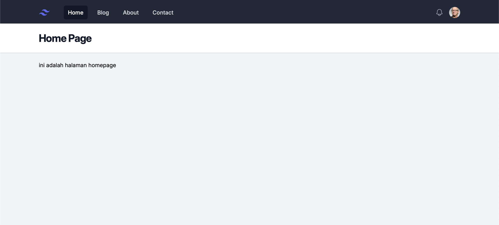
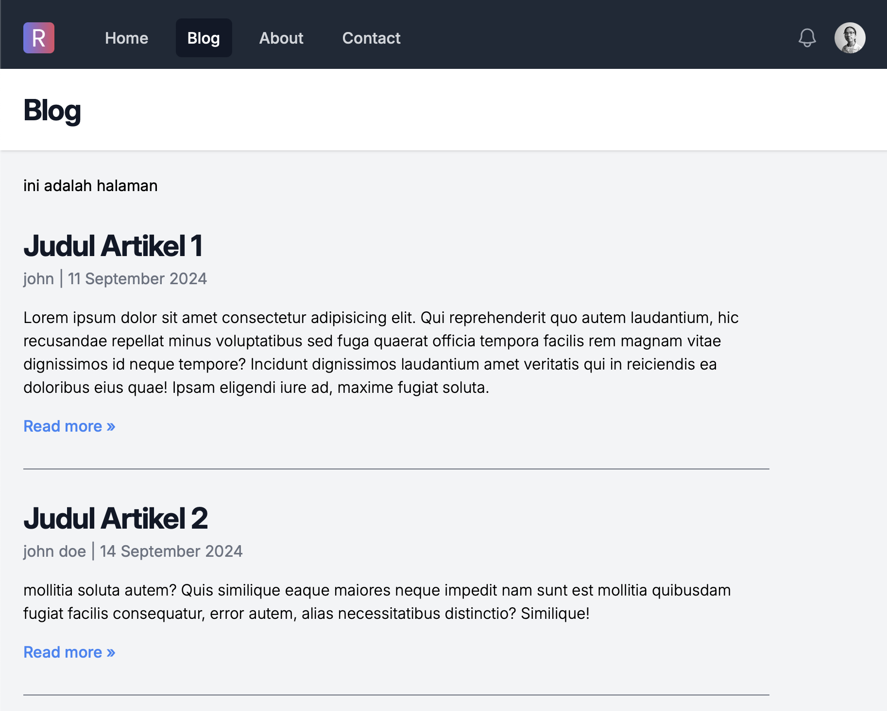
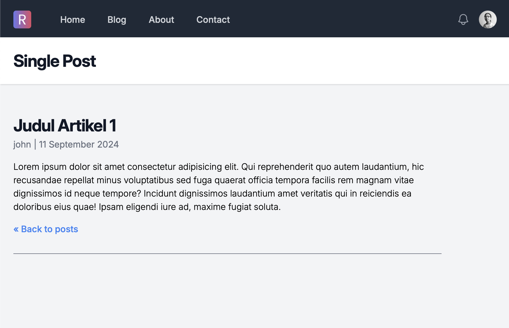

# PBKK using Laravel

## Progress up to Episode 5
### Installation
Laravel Herd is used to create this laravel project
### TailwindCSS
CSS framework used to apply styling directly in HTML components without creating css files
### Alpine.js
JavaScript framework applied directly in HTML
### Navbar
Using a pre-built navbar component from Tailwind UI, fixed with Alpine.js to bring functionality
### Component
Running <code>php artisan make:component ComponentName</code> will create 2 files, the blade <code>component-name.blade.php</code> and the class <code>ComponentName.php</code>. Components are used for reusability in the main blade view. Components are rendered with 
```blade
<x-component-name></x-component-name>
```
Anything that is inside the tag will be passed into the <code>{{$slot}}</code> in the component. Components <code>header.blade.php</code> and <code>navbar.blade.php</code> are created and rendered inside <code>layout.blade.php</code>. To make sure that the title text in the header corresponds with the page, the right text is passed as a variable <code>title</code> from route to <code>layout.blade.php</code> and then passed to <code>header.blade.php</code> by 
```blade
<x-header>{{$title}}</x-header>
```
then in <code>home.blade.php</code> is accessed with
```blade
<x-layout>
    <x-slot:title>{{$title}}</x-slot:title>
    <h3>ini adalah halaman homepage</h3>
</x-layout>
```
### Fixing Navbar
Another component is created for the navbar links <code>nav-link.blade.php</code> to make the link of the current route is selected. <code>href</code> attribute is passed to give the link and <code>active</code> variable is passed to know if the current route is the current webpage.
```blade
<a {{$attributes}}
    class="{{ $active ? 'bg-gray-900 text-white' : 'text-gray-300 hover:bg-gray-700 hover:text-white' }} px-3 py-2 font-medium rounded-md"
    aria-current="{{$active ?'page':false}}">
    {{$slot}}
</a>
```
```blade
<x-nav-link href="/" :active="request()->is('/')">Home</x-nav-link>
<x-nav-link href="/blog" :active="request()->is('blog')">Blog</x-nav-link>
<x-nav-link href="/about" :active="request()->is('about')">About</x-nav-link>
<x-nav-link href="/contact" :active="request()->is('contact')">Contact</x-nav-link>
```
### Result



## Progress up to Episode 7


### Storing data in model
Since we have not implement database, we can store our posts in the <code>Post.php</code> model with the attributes id, slug, title, author, date, and body. The data are stored in a static function <code>all()</code> that returns an array of the posts.
```php
public static function all(){
    return [
        [
            'id'=>1,
            'slug'=>'judul-artikel-1',
            'title'=>'Judul Artikel 1',
            'author'=>'john',
            'date'=>'11 September 2024',
            'body'=>'example body text here'
        ], 
        //more posts
    ]
}
```
A function that returns a post when given a model is also created. The reason of using a slug instead of an id is a slug is more secure since we cannot guess an id by numbers. It is also make it more readable for users.
```php
public static function find($slug): array{
    $post = Arr::first(static::all(),function ($post) use ($slug){
        return $post['slug']==$slug;
    });
    if(!$post) abort(404);
    return $post;
}
```

### Passing data from model to view
We can pass variables to a view with the following code. For example in the <code>/posts</code> we pass the variable <code>title</code> with the value <code>Blog</code> and the variable <code>posts</code> with the return value from the previously made static function <code>all</code> in the <code>Post</code> model.
```php
Route::get('/posts', function () {
    return view('posts',[
        'title'=>'Blog',
        'posts'=> Post::all()
    ]);
});
```
Suppose we want to search for a specific post, we can pass the slug into the route then create a function that takes a slug and returns the view with the specific post by using the <code>find</code>> function.
```php
Route::get('/posts/{slug}',function($slug){
    $post = Post::find($slug);
    return view('post',[
        'title'=>'Single Post',
        'post'=>$post
    ]);
});
```

### Viewing data in blade
The previously passed variable can be used in the blade like this. <code>foreach</code> is a built in looping function in blade. We can pass the <code>posts</code> variable so we can show all posts in the model. Suppose we want to display the value of an attribute we can do <code>{{$post['attribute']}}</code> in the view.
```php
@foreach ($posts as $post)   
    <article class="max-w-screen-md py-8 border-b border-gray-500">
        <h2 class="mb-1 text-3xl font-bold tracking-tight text-gray-900 hover:underline">{{$post['title']}}</h2>
        <div class="text-base text-gray-500">
            <a href="">{{$post['author']}}</a> | {{$post['date']}}
        </div>
        <p class="my-4 font-light">
            {{-- {{Str::limit($post['body'],100)}} --}}
            {{$post['body']}}
        </p>
        {{-- href="/posts/{{$id}}"  --}}
        <a href="/posts/{{$post['slug']}}" class="font-medium text-blue-500">Read more &raquo;</a>
    </article>
@endforeach
```

### Result
<code>/posts</code>

<code>/posts/judul-artikel-1</code>


## Progress up to Episode 7
Migrations is the way to define your tables and it's attributes for your database. Run <code>php artisan make:migration</code> to create a migration. After defining the attributes according to the data type and constraints, run <code>php artisan migrate</code> that would create your tables into your configured database.

Model will be the architecture that interacts with the database directly. When creating a model, it automatically binds to a certain table (there is also a way to manually bind a table with a model). A model already has a built in function like <code>all()</code> and <code>find()</code> that do not need to be defined anymore. We can also set which attributes can be filled by the user by writing <code>protected $fillable = ['attributeName']</code> or vice versa by writing <code>protected $guarded = ['attributeName']</code>.

## Progress up to Episode 13

### Model Relation
We can define relation between models. Suppose we have a one to many relation between Category and Post, then we can say a Category hasMany Post and a Post belongsTo a Category with the following code.
<code>Post.php</code>
```php
public function category(): BelongsTo{
    return $this->belongsTo(Category::class);
}
```
<code>Category.php</code>
```php
public function posts():HasMany{
    return $this->hasMany(Post::class);
}
```
By doing so when we have a model of Post then call the <code>category</code> method, we could get the model of the category that is linked with the post. If we call <code>posts</code> in a category model, we would get all posts with that category.

### Factory
We can use the Faker Library to generate dummy data by defining it an a factory. We can just call the methods inside <code>fake()</code> to get dummy data that we need. We can also call other model's factory in a factory to get the model in it.
<code>PostFactory.php</code>
```php
public function definition(): array{
    return [
        'title'=>fake()->sentence(),
        'author'=>fake()->name(),
        'author_id'=>User::factory(),
        'slug'=>Str::slug(fake()->sentence()),
        'body'=>fake()->text()
    ];
}
```
Suppose if we want to have a foreign key from a certain table name we can use the following.
```php
$table->foreignId('author_id')->constrained(
    table:'users',
    indexName:'posts_author_id'
);
```

### Seeder
We can call a factory from a seeder file.
<code>DatabaseSeeder.php</code>
```php
class DatabaseSeeder extends Seeder{
    public function run(): void{
        $this->call([CategorySeeder::class, UserSeeder::class]);
        Post::factory(100)->recycle([Category::all(),User::all()])->create();
    }
}
```