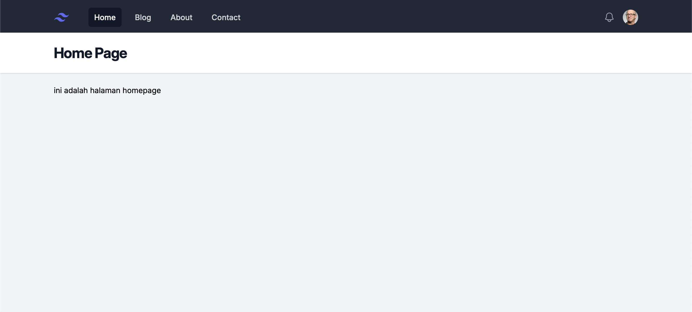

# PBKK using Laravel

## Progress up to Episode 5
### Installation
Laravel Herd is used to create this laravel project
### TailwindCSS
CSS framework used to apply styling directly in HTML components without creating css files
### Alpine.js
JavaScript framework applied directly in HTML
### Navbar
Using a pre-built navbar component from Tailwind UI, fixed with Alpine.js to bring functionality
### Component
Running <code>php artisan make:component ComponentName</code> will create 2 files, the blade <code>component-name.blade.php</code> and the class <code>ComponentName.php</code>. Components are used for reusability in the main blade view. Components are rendered with 
```blade
<x-component-name></x-component-name>
```
Anything that is inside the tag will be passed into the <code>{{$slot}}</code> in the component. Components <code>header.blade.php</code> and <code>navbar.blade.php</code> are created and rendered inside <code>layout.blade.php</code>. To make sure that the title text in the header corresponds with the page, the right text is passed as a variable <code>title</code> from route to <code>layout.blade.php</code> and then passed to <code>header.blade.php</code> by 
```blade
<x-header>{{$title}}</x-header>
```
then in <code>home.blade.php</code> is accessed with
```blade
<x-layout>
    <x-slot:title>{{$title}}</x-slot:title>
    <h3>ini adalah halaman homepage</h3>
</x-layout>
```
### Fixing Navbar
Another component is created for the navbar links <code>nav-link.blade.php</code> to make the link of the current route is selected. <code>href</code> attribute is passed to give the link and <code>active</code> variable is passed to know if the current route is the current webpage.
```blade
<a {{$attributes}}
    class="{{ $active ? 'bg-gray-900 text-white' : 'text-gray-300 hover:bg-gray-700 hover:text-white' }} px-3 py-2 font-medium rounded-md"
    aria-current="{{$active ?'page':false}}">
    {{$slot}}
</a>
```
```blade
<x-nav-link href="/" :active="request()->is('/')">Home</x-nav-link>
<x-nav-link href="/blog" :active="request()->is('blog')">Blog</x-nav-link>
<x-nav-link href="/about" :active="request()->is('about')">About</x-nav-link>
<x-nav-link href="/contact" :active="request()->is('contact')">Contact</x-nav-link>
```
### Result



## Progress up to Episode 5
### Viewing data


### Storing data in model